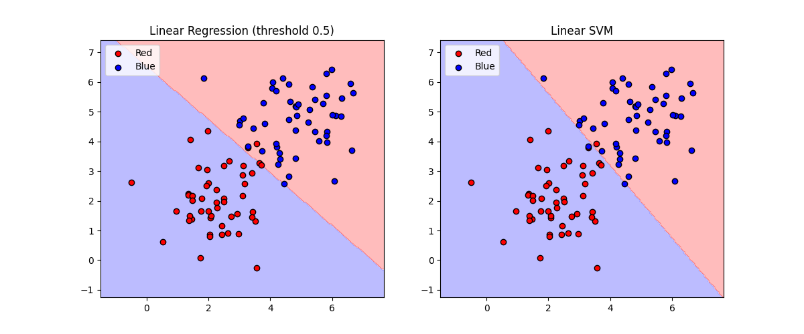

# 线性回归 vs 线性 SVM：分类对比实验

## 📌 项目简介

本项目是一个极简的机器学习对比实验，用于展示**线性回归**（以 0.5 为阈值）和**线性支持向量机（SVM）** 在二分类任务上的区别。

- 在二维平面上生成线性可分的红蓝点（各 50 个）
- 分别训练线性回归模型和线性 SVM
- 比较两者的决策边界、训练/测试准确率，并分析各自的优缺点

> 该项目是我在准备研究生复试期间完成的，旨在从数学角度理解不同优化目标（最小二乘 vs 最大间隔）对分类器行为的影响。



## 📁 文件结构
├── linear_vs_svm.py # 主程序（生成数据、训练、评估、绘图）
├── requirements.txt # 依赖库列表
└── README.md # 本文件

## ⚙️ 环境依赖

- Python 3.7+
- NumPy
- Matplotlib
- scikit-learn

安装依赖：
```bash
pip install -r requirements.txt
